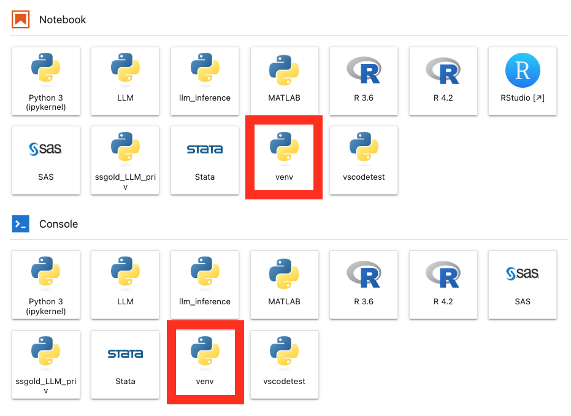
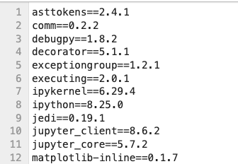

# {{ page.title }}

Virtual environments are a foundational aspect of professional development, allowing developers to isolate and manage packages and dependencies specific to individual projects or tasks. This isolation is crucial in maintaining a clean and organized development workspace, as it prevents conflicts between packages used in different projects. Furthermore, virtual environments ensure that projects are reproducible and can be shared with others without compatibility issues, as all the necessary dependencies are clearly defined and contained within the environment.

## Different Tools for Python Environment Management

* [`venv`](https://docs.python.org/3/library/venv.html): built into Python 3.3 and later. (Recommended)
* [`Anaconda`](https://www.anaconda.com/products/distribution): third-party tool popular in data science.
* [`renv`](https://rstudio.github.io/renv/articles/renv.html): renv package helps you create reproducible environments for your R projects.


## Best Practices for Environment Management

1. **Creating a New Environment for Each Project**: This ensures that each project has its' own set of dependencies.

2. **Documenting Dependencies**: Clearly list all dependencies in a requirements file or using a tool that automatically manages this aspect.

3. **Regularly Updating Dependencies**: Keep the dependencies up-to-date to ensure the security and efficiency of your projects.


## Recommendations on the Yens

{: .important}
We highly recommend using `venv`, Python’s built-in tool for creating virtual environments, especially in shared systems like the Yens. This recommendation is rooted in several key advantages that `venv` offers over other tools like `conda`:

* **Built-in and Simple**: `venv` is included in Python's standard library, eliminating the need for third-party installations and making it straightforward to use, especially beneficial in shared systems where ease of setup and simplicity are crucial.

* **Fast and Resource-Efficient**: `venv` offers quicker environment creation and is more lightweight compared to tools like `conda`, making it ideal for shared systems where speed and efficient use of resources are important.

* **Ease of Reproducibility**: `venv` allows for easy replication of environments by using a `requirements.txt` file, ensuring that the code remains reproducible and consistent regardless of the platform.

* **Terminal Agnostic**: `venv`  allows you to work across various terminals—including JupyterHub, Linux Terminal, and Slurm—from a single unified location

## Creating a New Virtual Environment with `venv`

Let's navigate to a project directory:

```bash
cd <path/to/project>
```
where `<path/to/project>` is the shared project location on ZFS.

Create a new virtual environment:

```bash
/usr/bin/python3  -m venv venv # Note venv is a customizable name
```
where we make a directory `venv` inside the project directory. 

## Activating a New Virtual Environment 

Next, we activate the virtual environment:
```bash
source venv/bin/activate
```

You should see `(venv):` prepended to the prompt: 
```bash
(venv): 
```

Check Python version:

```bash
which python
/path/to/env/venv/bin/python
```

## Installing Python Packages within the New Virtual Environment
Install any python package with `pip`:

```bash
(venv) $ pip install <package>
```


## Making the Virtual Environment into a JupyterHub Kernel 
Install `ipykernel` package before installing the new environment as a kernel on JupyterHub:

```bash
(venv) $ pip install ipykernel
```

To add the **active** virtual environment as a kernel, run:
```bash
(venv) $ python -m ipykernel install --user --name=<kernel-name>
```
where `<kernel-name>` is the name of the kernel on JupyterHub.

Example 
```bash
(venv) $ python -m ipykernel install --user --name=venv
```



## Sharing the Environment

Environments can get quite large and take up lots of space depending on the project. An easy way to share them is you share the requirements.txt file which is a list of all the libraries and versions. 

```bash 
(venv) $  pip freeze > requirements.txt 
```
This will be different depending on which packages you install and can help users run the code you developed using that environment.



To then replicate an environment you need to perform the following steps:

```bash
$ /usr/bin/python3 -m venv new_venv # Create the new environment
$ source new_venv/bin/activate # Activate the new environment
(new_venv)$ pip install -r requirements.txt # Install the packages
```

{: .warning}
Once the virtual environments are created they SHOULD NOT be moved. This will break the environment and you may need to recreate it.


### Deactivating the Virtual Environment
You can deactivate the virtual environment with:
```
$ deactivate
```

### Removing the Virtual Environment
If you created a Jupyter kernel you will first need to remove that with the following command from your home from **within** your virtual environment

```bash 
(venv) $ jupyter kernelspec uninstall venv
```


If you would like to delete the previously created virtual enviroment, simply delete the environment directory since `venv` environment is essentially a directory containing files and folders. 

```
$ rm -rf venv
```

# Exercise

1. Navigate to `examples/python_examples`
2. Create a new virtual environment named **venv**
3. Activate the environment
4. Install the packages in `requirements.txt`

<details>
<summary>Click for answer</summary>
<div class="language-bash highlighter-rouge">
<pre class="highlight"><code>
<span class="nv">$ </span><span class="nb">cd examples/python_examples</span>
<span class="nv">$ </span><span class="nb">/usr/bin/python3 -m venv venv</span>
<span class="nv">$ </span><span class="nb">source venv/bin/activate</span>
<span class="nv">(venv) $ </span><span class="nb">pip install -r requirements.txt</span>
</code></pre>
</div>
</details>
